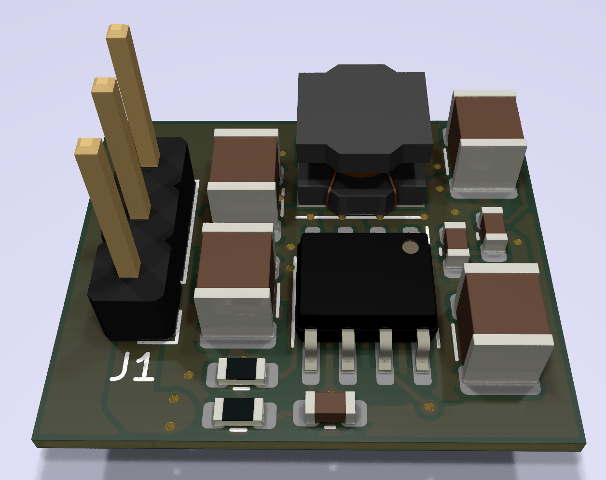
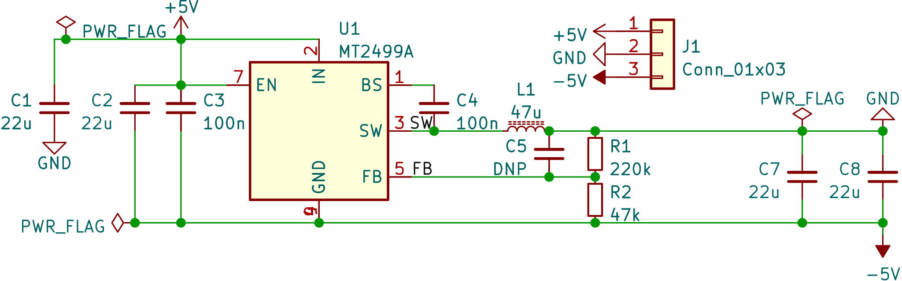

# Inverting buck-boost controller

Using the documentation in [TI's SLVA458B, "Creating an Inverting Power Supply Using a Synchronous Step-Down Regulator"][SLVA458B], I've designed an inverting buck-boost regulator using the super-cheap Aerosemi MT2499A, and characterized its performance somewhat.

[SLVA458B]: https://www.ti.com/lit/an/slva458b/slva458b.pdf?ts=1675589999464

[board layers](doc/layers.pdf)

## Testing

There's a massive amount of 7kHz ripple, up to 500mV before stopping testing at 300mA.

This seems to be related to very poor regulator stability. Placing 33pF in C5 improves ripple to 30mV between 0-220mA out, but the ripple is back to 500mV at 230mA.

|Cff|Imax|
|===|===|
|32pF|225mA|
|54pF|285mA|

Linear interpolation indicates 133pF would be needed for stability at 500mA, but I'm not sure if linear interpolation is valid here.

I also suspect that it is not possible to create a perfectly compensated regulator here, since the MT2499A is internally compensated, and the procedure that SLVA458B describes to compensate the regulator is just not possible.